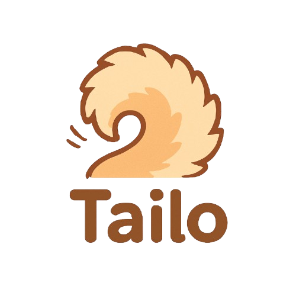

 

  <h1>Tailo</h1>
  
반려동물 기반 SNS 플랫폼

 

  

 

  <a href="https://taillo-ten.vercel.app/login">홈페이지</a>

---

## ✍️ 프로젝트 개요

- **프로젝트명:** Tailo (반려동물 기반 SNS 플랫폼)
- **프로젝트 기간:** 2025.04.12 ~ 2025.04.30

---

## ✍️ 프로젝트 소개

### 프로젝트 배경
 - 반려동물과의 소중한 일상을 기록하고, 이를 다른 반려인들과 공유할 수 있는 전용 소셜 플랫폼을 만들고자 하였습니다.   단순한 사진 공유를 넘어, 반려동물 중심의 커뮤니티 형성을 목표로 하였습니다.

---

## 📌 주요 기능

### **1. 사용자 기능**
- 소셜 로그인
- 프로필 정보 조회 / 수정 기능
  - 프로필 이미지 업로드

### **2. 피드**
- 게시글 작성 / 수정 / 삭제 기능
  - 이미지 및 해시태그 첨부 가능
- 피드별 댓글 및 좋아요 기능

### **3. 소셜 네트워크 기능**
- 사용자 간 팔로우 / 언팔로우 / 차단 기능
- 피드 및 사용자 검색 기능

### **4. 1:1 실시간 채팅 기능**
- 실시간 메시지 전송 및 수신

---

## 🧑‍💻 팀원 소개

| **이름**    | **역할**        | 
|:-----------:|:---------------:|
| 오예준      | BE              | 
| 정누리      | BE              | 
| 정하승      | FE              | 

---

## ⚙️ 기술 스택

  

<table>
  <thead>
    <tr>
      <th>분류</th>
      <th>기술 스택</th>
    </tr>
  </thead>
  <tbody>
    <tr>
      <td>프론트엔드</td>
      <td>
        
        
      </td>
    </tr>
    <tr>
      <td>백엔드</td>
      <td>
        
        
        
        
      </td>
    </tr>
    <tr>
      <td>데이터베이스</td>
      <td>
        
        
      </td>
    </tr>
    <tr>
      <td>인프라</td>
      <td>
        
        
        
        
        
        
    </tr>
  </tbody>
</table>

---

## 📂 기타

- [FrontEnd 개발 트래커](https://github.com/orgs/Tailo-Project/projects/5)
- [BackEnd 개발 트래커](https://github.com/orgs/Tailo-Project/projects/3/views/2)

---
